<h1 align="center" font-size="200em"><b>Jogo da Vida e Manipulação de Matrizes</b></h1>

## Introdução
<p align="justify">
Este projeto foi desenvolvido em C++ como parte da disciplina de Algoritmos e Estruturas de Dados I. Ele visa simular o famoso "Jogo da Vida" criado por John Conway em 1970. O jogo é representado por uma matriz de células, onde cada célula pode estar viva ou morta. A evolução dessa matriz segue regras específicas baseadas no estado dos vizinhos de cada célula, determinando se a célula sobrevive, morre ou revive.

</p>

## Objetivos
<p align="justify">
O principal objetivo deste trabalho é implementar uma simulação do "Jogo da Vida" usando uma matriz bidimensional. O programa permite ao usuário definir o tamanho da matriz, seus elementos e o número de gerações que deseja visualizar. O valor "1" representa uma célula viva, e "0" representa uma célula morta, sendo que o objetivo é manter uma proporção aproximada de 2 células vivas para cada 1 célula morta.

As regras do Jogo da Vida são as seguintes:

- Uma célula morta com exatamente três vizinhos vivos torna-se viva.
- Uma célula viva com menos de dois vizinhos vivos morre por isolamento.
- Uma célula viva com mais de três vizinhos vivos morre por superpopulação.
- Uma célula viva com dois ou três vizinhos vivos permanece viva.

<p align="center">
  
</p>

## Estrutura de Arquivos
### dataset
- ```input.mps.txt```: Contém a matriz inicial e seu tamanho.
- ```geracoes.mps.txt```: Armazena as gerações calculadas, incluindo a matriz inicial.
## src
- ```matriz.hpp```: Cabeçalhos e definições para manipulação de matrizes.
- ```matriz.cpp```: Contém o código de funcionamento das funções da classe Matriz (manipulação);
- ```main.cpp```: Arquivo principal que executa o programa.

## Resolução e Lógica
<p align="justify">
Inicialmente decidi como minha matriz seria implementada, então decidi trabalhar com a biblioteca "vector" devido a sua facilidade na manipulação de vetores. Transformando a minha matriz em um vetor de vetores de tipo inteiro. Também precisaria da biblioteca "fstream" para manipular os arquivos de texto. Além disso adaptei meu sistema para utilizar apenas duas matrizes e alternar entre estas durante a execução. Assim criei a classe Matriz para uma melhor organização e implementei os seguintes comandos:
  
- ```vector<vector<int>> lerMatriz(string arquivo)```: Recebe o nome do arquivo e lê a matriz contida no mesmo, retornando esta;
- ```void printarMatriz(const vector<vector<int>>& matriz)```: Recebe a matriz e printa a mesma no terminal;
- ```void criarGeracao(const vector<vector<int>>& entrada, vector<vector<int>>& saida)```: Recebe a matriz de entrada, aplica as regras do Jogo da Vida e implementa na segunda matriz;
- ```void registrarMatriz(const vector<vector<int>>& matriz, const string& nomeArquivo,const int cont)```:Recebe a matriz e implementa no arquivo de texto, junto ao número de geração desejado;
- ```void limparMatriz(vector<vector<int>>& matriz)```: Limpa a matriz desejada, deixando a mesma propícia para o rodízio do programa;
- ```void menu()```: Implementa o menu responsável por executar o ciclo do programa;

<p align="center">
  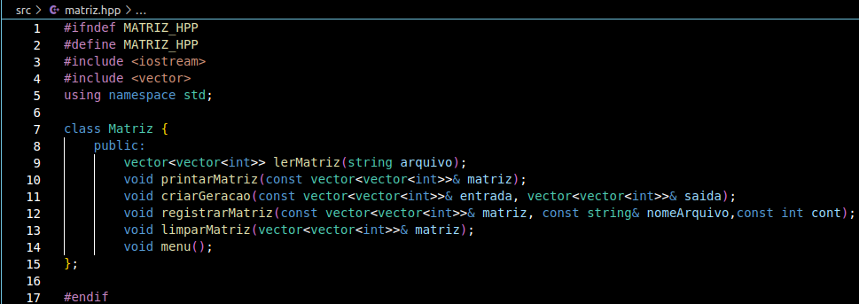
  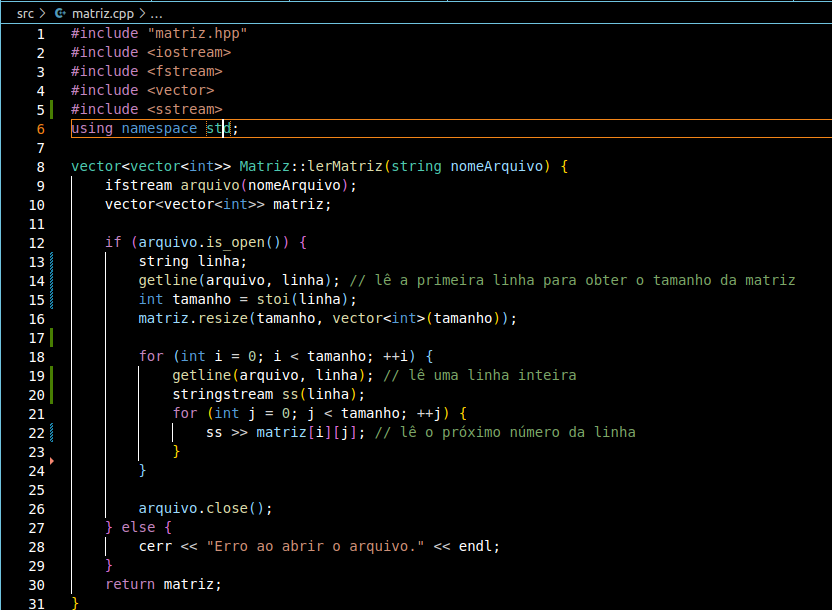
  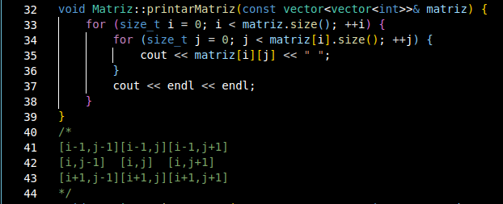
  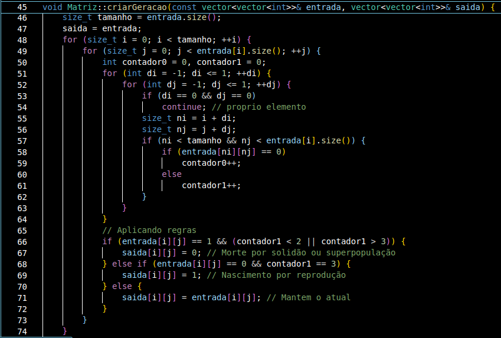
  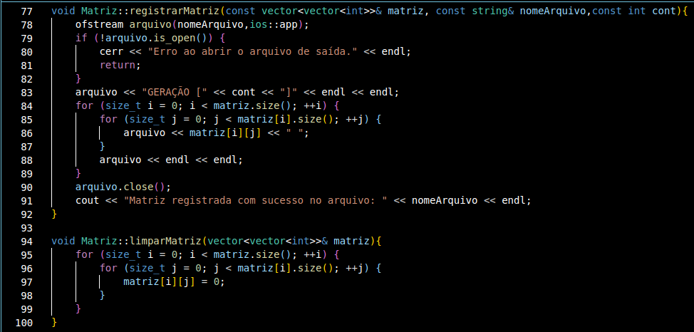
  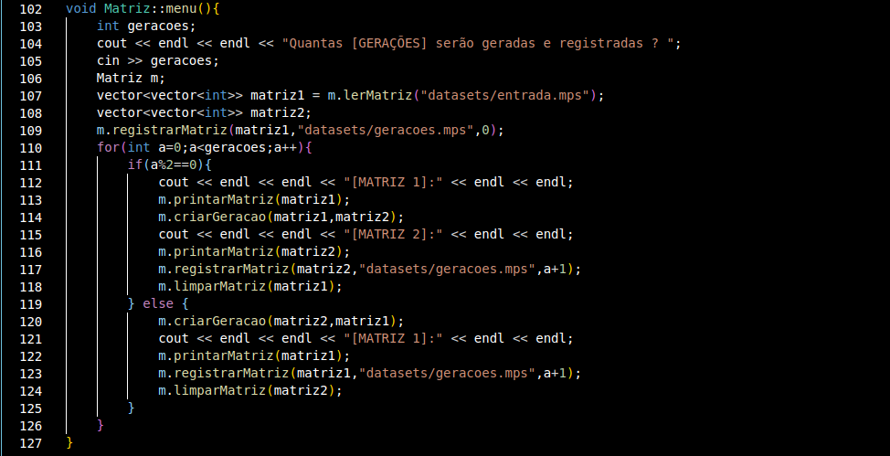
  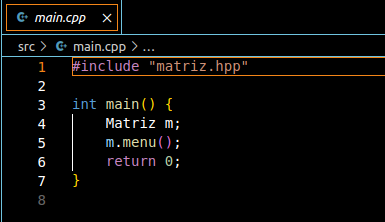
</p>

## Fluxo de Execução do Programa e Funções Implementadas
<p align="justify">
Inicialmente o programa executa o menu, que por sua vez solicita ao usuário o númerode geracões que serão geradas e arquivadas. Após isso criamos um objeto Matriz "m" para dar inicio as funções, sendo a primeira colocar dentro de uma das matrizes declaradas com vector a matriz do arquivo através da função "lerMatriz", a segunda permanece vazia para receber a primeira geração. Após isso também registramos a matriz do arquivo "input.mps" no arquivo "geracoes.mps".

Depois disso inicia-se um 'for' que irá percorrer o número de gerações solicitado, variando entre uma geração par no primeiro bloco 'if', onde chama-se a função "criarGeracao" que recebe a "matriz1" (matriz lida do arquivo) e joga a nova geração para a segunda matriz, printando as mesmas para analise no terminal, registrando a "matriz2" (matriz ainda vazia) no arquivo, e logo após limpando a matriz1 para o ciclo. E o segundo bloco 'If', que é executado em gerações ímpares executa o mesmo processo, porém com a matriz2 agora funcionando como entrada e sendo limpada ao fim enquanto a matriz1 é registrada no arquivo, e repetindo o ciclo até o fim do 'for'.

A função "lerMatriz" utiliza da biblioteca fstream para ler do arquivo, retornando uma matriz de vetor de vetores de inteiros. No inicio do arquivo consta o tamanho da matriz quadrada, assim o programa lê o mesmo e ignora o proximo char (\n). Após isso o for do tamanho da matriz lê char por char e transforma o char em um inteiro através do codigo ASCII.

A função "printarMatriz" utiliza de uma função da vector para receber o tamanho dos vetores e percorre a matriz printando os dados ali dentro.

A função "criarGeracao" recebe a matriz de entrada e analisa dado por dado através de um bloco for que ignora elementos que poderiam ser acessados por engano por fora da matriz. Inicializando os contadores de "0" e "1" em 0, além de utilizar de for com indices nj e ni para evitar os acessos fora da memória como citados acima através do if dentro destes. E assim ele contabiliza os dados ao redor da posição da matriz e no fim faz a analise, jogando o resultado para a segunda matriz da função.

A função "limparMatriz" recebe uma matriz e limpa elemento por elemento através de um for do seu tamanho.

A função "registrarMatriz" abre o arquivo para escrita, utiliza de um for do tamanho da matriz recebida e coloca dentro do arquivo a matriz desejada, junto com o número da geração estabelecido.

## Casos de Teste
<p align="justify">
Agora indo para os casos de testes, iremos testar matrizes distintas com tamanhos distintos,variando entre uma de tamanho 6x6, outra 8x8 e por fim uma 10x10. Tem-se a seguinte matriz de entrada com tamanho 6x6 que após 6 gerações deve estar:
<p align="center">
  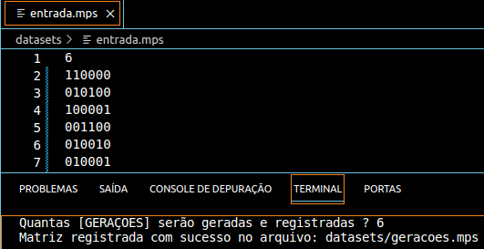
  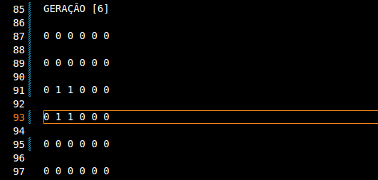
</p>

Tem-se a seguinte matriz de entrada com tamanho 8x8 que após 8 gerações deve estar:
<p align="center">
  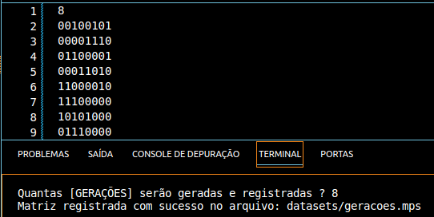
  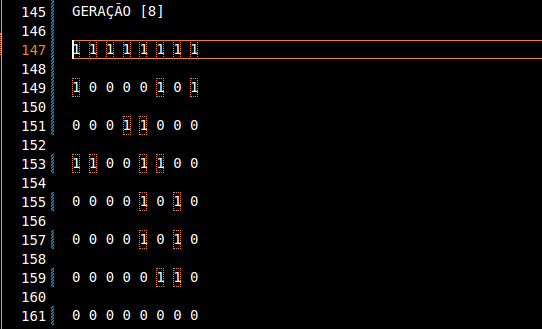
</p>

Tem-se a seguinte matriz de entrada com tamanho 10x10 que após 10 gerações deve estar:
<p align="center">
  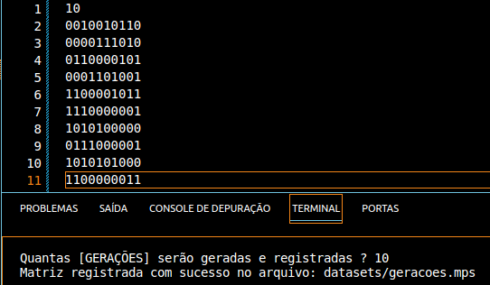
  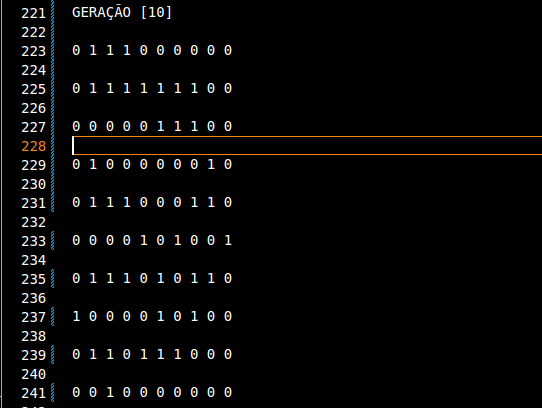
</p>


</p>


## Conclusão
<p align="justify">
  Este projeto proporcionou uma experiência prática no desenvolvimento de algoritmos, explorando tanto a manipulação de matrizes quanto a lógica envolvida na simulação de sistemas complexos, como o "Jogo da Vida". Além de aplicar conceitos fundamentais de programação e estruturas de dados, o trabalho também oferece uma oportunidade de reflexão sobre a relação entre simplicidade e complexidade em sistemas dinâmicos.
</p>
<p align="justify">
  A simulação do Jogo da Vida, embora baseada em regras simples, demonstra como interações locais podem resultar em padrões globais interessantes e, às vezes, imprevisíveis. Isso nos leva a pensar sobre o comportamento emergente que pode ser observado em muitos fenômenos naturais e até mesmo na forma como o universo opera.
</p>
<p align="justify">
  No geral, o desenvolvimento do projeto não só consolidou habilidades técnicas, como também suscitou questões filosóficas sobre a criação de ordem a partir do caos, oferecendo uma rica fonte de aprendizado interdisciplinar.
</p> 

## Referências
  Jogo da vida. In: WIKIPÉDIA: a enciclopédia livre. Flórida: Wikimedia Foundation, 2022. Disponível em: <a href="https://pt.wikipedia.org/wiki/Jogo_da_vida">https://pt.wikipedia.org/wiki/Jogo_da_vida</a>.
  </p>
 O Jogo da Vida e sua relação com sistemas dinâmicos. Revista de Processos Matemáticos. Disponível em: <a href="https://rpm.org.br/cdrpm/74/3.html">https://rpm.org.br/cdrpm/74/3.html</a>.


## Compilação e execução
* | Comando                |  Função                                                                                           |                     
  | -----------------------| ------------------------------------------------------------------------------------------------- |
  |  `make clean`          | Apaga a última compilação realizada contida na pasta build                                        |
  |  `make`                | Executa a compilação do programa utilizando o gcc, e o resultado vai para a pasta build           |
  |  `make run`            | Executa o programa da pasta build após a realização da compilação                                 |

## Informações e Contato
✉️ <i>pedroaugustomoura70927@gmail.com</i>
</a>
